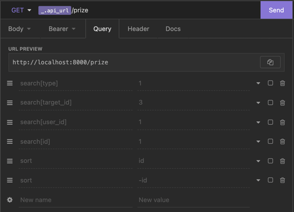

# test_slotegrator

Project deployment instructions:
1) Clone the project.
2) Copy the file "env.example.php" to the root of the project and name it "env.php".
3) Run the command "composer install".
4) Run the command "php -S localhost:8000"
5) Run the command "php run-migrations.php"
6) Run the command "php run-seeders.php"
___

# Routes:
<h3>Users management:</h3>
**POST:** `/user`  
**AUTH:** `false`  
**DESCRIPTION:** _New user registration_  
**BODY**: {  
&nbsp;&nbsp;name: 'required', 'str', 'min:3', 'max:255',  
&nbsp;&nbsp;email: 'required', 'email',  
&nbsp;&nbsp;password: 'required', 'str', 'min:8', 'max:255'  
}  
 

[comment]: <> (___)

[comment]: <> (**POST:** `/auth/login`  )

[comment]: <> (**AUTH:** `false`  )

[comment]: <> (**DESCRIPTION:** _Login_  )

[comment]: <> (**BODY**: {  )

[comment]: <> (&nbsp;&nbsp;email: 'required', 'email',  )

[comment]: <> (&nbsp;&nbsp;password: 'required', 'str', 'min:8', 'max:255'  )

[comment]: <> (}  )

[comment]: <> ( )

[comment]: <> (___)

[comment]: <> (**GET:** `/auth/me`  )

[comment]: <> (**AUTH:** `true`  )

[comment]: <> (**DESCRIPTION:** _Get auth user_  )

[comment]: <> ( )

[comment]: <> (___)

[comment]: <> (**GET:** `/user`  )

[comment]: <> (**AUTH:** `true`  )

[comment]: <> (**DESCRIPTION:** _Get all users_  )

[comment]: <> (**QUERY**: {  )

[comment]: <> (&nbsp;&nbsp; sort: `id, -id, created_at, -created_at`  )

[comment]: <> (&nbsp;&nbsp; search: `[id, email, name]` )

[comment]: <> (}  )

[comment]: <> ( )

[comment]: <> (___)

[comment]: <> (**GET:** `/user/:id`  )

[comment]: <> (**AUTH:** `true`  )

[comment]: <> (**DESCRIPTION:** _Get one user_  )

[comment]: <> ( )

[comment]: <> (___)

[comment]: <> (**PUT:** `/user/:id`  )

[comment]: <> (**AUTH:** `true`  )

[comment]: <> (**DESCRIPTION:** _Update user_  )

[comment]: <> (**BODY**: {  )

[comment]: <> (&nbsp;&nbsp;name: 'required', 'str', 'min:3', 'max:255',  )

[comment]: <> (&nbsp;&nbsp;email: 'required', 'email',  )

[comment]: <> (&nbsp;&nbsp;password: 'required', 'str', 'min:8', 'max:255'  )

[comment]: <> (}  )

[comment]: <> ( )

[comment]: <> (___)

[comment]: <> (**DELETE:** `/user/:id`  )

[comment]: <> (**AUTH:** `true`  )

[comment]: <> (**DESCRIPTION:** _Delete user_  )

[comment]: <> ( )

[comment]: <> (___)

[comment]: <> (<h3>Products management &#40;физический предмет&#41;:</h3>)

[comment]: <> (**GET:** `/product`  )

[comment]: <> (**AUTH:** `true`  )

[comment]: <> (**DESCRIPTION:** _Get all products_  )

[comment]: <> (**QUERY**: {  )

[comment]: <> (&nbsp;&nbsp; sort: `id, -id, count, -count`  )

[comment]: <> (&nbsp;&nbsp; search: `[id, name, count]` )

[comment]: <> (}  )

[comment]: <> ( )

[comment]: <> (___)

[comment]: <> (**POST:** `/product`  )

[comment]: <> (**AUTH:** `true`  )

[comment]: <> (**DESCRIPTION:** _Create new product_  )

[comment]: <> (**BODY**: {  )

[comment]: <> (&nbsp;&nbsp;name: 'required', 'str', 'min:3', 'max:255',  )

[comment]: <> (&nbsp;&nbsp;description: 'required', 'str', 'min:3', 'max:255',  )

[comment]: <> (&nbsp;&nbsp;count: 'required', 'int', 'min:2', 'max:200'  )

[comment]: <> (}  )

[comment]: <> ( )

[comment]: <> (___)

[comment]: <> (**GET:** `/product/:id`  )

[comment]: <> (**AUTH:** `true`  )

[comment]: <> (**DESCRIPTION:** _Get one product_  )

[comment]: <> ( )

[comment]: <> (___)

[comment]: <> (**PUT:** `/product/:id`  )

[comment]: <> (**AUTH:** `true`  )

[comment]: <> (**DESCRIPTION:** _Update product_  )

[comment]: <> (**BODY**: {  )

[comment]: <> (&nbsp;&nbsp;name: 'required', 'str', 'min:3', 'max:255',  )

[comment]: <> (&nbsp;&nbsp;description: 'required', 'str', 'min:3', 'max:255',  )

[comment]: <> (&nbsp;&nbsp;count: 'required', 'int', 'min:2', 'max:200'  )

[comment]: <> (}  )

[comment]: <> ( )

[comment]: <> (___)

[comment]: <> (<h3>Monetary management &#40;случайная сумма в интервале&#41;:</h3>)

[comment]: <> (**GET:** `/monetary`  )

[comment]: <> (**AUTH:** `true`  )

[comment]: <> (**DESCRIPTION:** _Get all monetary_  )

[comment]: <> (**QUERY**: {  )

[comment]: <> (&nbsp;&nbsp; sort: `id, -id, type, -type`  )

[comment]: <> (&nbsp;&nbsp; search: `[id, type]` )

[comment]: <> (}  )

[comment]: <> ( )

[comment]: <> (___)

[comment]: <> (**POST:** `/monetary`  )

[comment]: <> (**AUTH:** `true`  )

[comment]: <> (**DESCRIPTION:** _Create new monetary_  )

[comment]: <> (**BODY**: {  )

[comment]: <> (&nbsp;&nbsp; type: bonus or real money,  )

[comment]: <> (&nbsp;&nbsp; max_sum: 'int', 'min:1'  )

[comment]: <> (&nbsp;&nbsp; interval_from: 'required', 'int', 'min:1', 'max:interval_to'  )

[comment]: <> (&nbsp;&nbsp; interval_to: 'required', 'int', 'min:interval_from', 'max:max_sum'  )

[comment]: <> (}  )

[comment]: <> ( )

[comment]: <> (___)

[comment]: <> (**GET:** `/monetary/:id`  )

[comment]: <> (**AUTH:** `true`  )

[comment]: <> (**DESCRIPTION:** _Get one monetary_  )

[comment]: <> ( )

[comment]: <> (___)

[comment]: <> (**PUT:** `/monetary/:id`  )

[comment]: <> (**AUTH:** `true`  )

[comment]: <> (**DESCRIPTION:** _Update monetary_  )

[comment]: <> (**BODY**: {  )

[comment]: <> (&nbsp;&nbsp; max_sum: 'int', 'min:1'  )

[comment]: <> (&nbsp;&nbsp; interval_from: 'required', 'int', 'min:1', 'max:interval_to'  )

[comment]: <> (&nbsp;&nbsp; interval_to: 'required', 'int', 'min:interval_from', 'max:max_sum'  )

[comment]: <> (}  )

[comment]: <> ( )

[comment]: <> (___)

[comment]: <> (<h3>Prize &#40;Призы&#41;:</h3>)

[comment]: <> (**GET:** `/prize`  )

[comment]: <> (**AUTH:** `true`  )

[comment]: <> (**DESCRIPTION:** _Get all prizes_  )

[comment]: <> (**QUERY**: {  )

[comment]: <> (&nbsp;&nbsp; sort: `id, -id`  )

[comment]: <> (&nbsp;&nbsp; search: `[target_id, type, user_id]` )

[comment]: <> (}  )

[comment]: <> ( )

[comment]: <> (___)

[comment]: <> (**POST:** `/prize`  )

[comment]: <> (**AUTH:** `true`  )

[comment]: <> (**DESCRIPTION:** _To receive a prize_  )

[comment]: <> ( )

[comment]: <> (___)

[comment]: <> (**GET:** `/prize/:id`  )

[comment]: <> (**AUTH:** `true`  )

[comment]: <> (**DESCRIPTION:** _Get one prize_  )

[comment]: <> ( )

[comment]: <> (___)

[comment]: <> (**DELETE:** `/prize/:id`  )

[comment]: <> (**AUTH:** `true`  )

[comment]: <> (**DESCRIPTION:** _Waiver of a prize_  )

[comment]: <> ( )

[comment]: <> (___)

[comment]: <> (**POST:** `/prize/:id/convert`  )

[comment]: <> (**AUTH:** `true`  )

[comment]: <> (**DESCRIPTION:** _Real money convert to bonus_  )

[comment]: <> ( )

[comment]: <> (___)

# Commands:
**NAME:** `php run-migrations.php`  
**DESCRIPTION:** _Runs all migrations from database/migrations directories_  
 
___
**NAME:** `php run-seeders.php`  
**DESCRIPTION:** _Runs all seeders from database/seeders directories_  
 
___
**NAME:** `php send-bonus.php`  
**DESCRIPTION:** _Accrues bonuses to users_  
 
___

# Additionally:
Project in Insomnia: [insomnia_project.json](Insomnia_project.json)  
Request example:  

